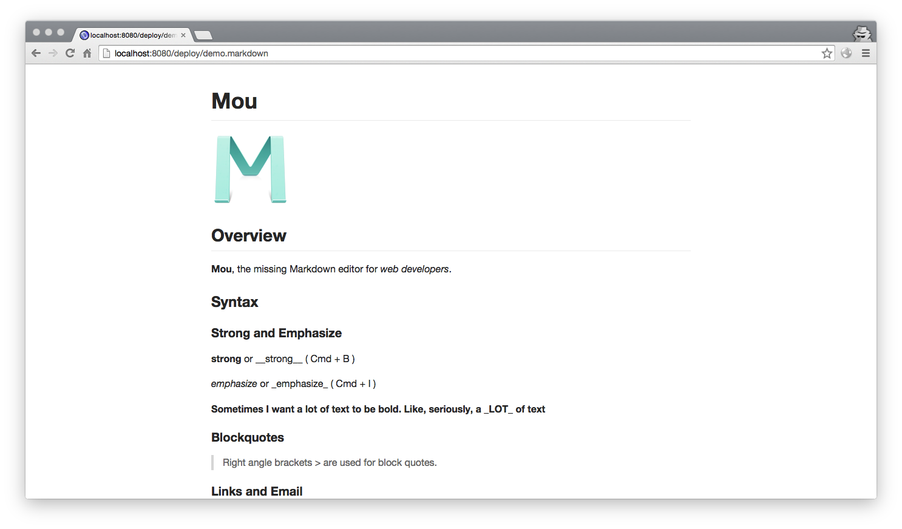

# Makedown Server

Host your local markdown files as webpages.

This little script works very similar with `python -m SimpleHTTPServer`, but it supports markdown files, all files with `.markdown` or `.md` extensions will be served as corresponding HTML webpages, and the pages are beautified with github markdown stylesheet(thanks to https://github.com/sindresorhus/github-markdown-css).

## Install

    sudo pip install markdown2
    sudo pip install bottle
	sudo pip install beaker
	sudo pip install simpleyaml
	sudo pip install qrcode
	git clone git@github.com:xumingming/mdserver.git
	cd mdserver

## Usage

    python2 mdserver.py <full-path-of-your-mdserver-directory>

The reason that you need to specify `<full-path-of-your-mdserver-directory>` is: we need to find the `css` which will used to beautify your document.

The above command should be invoked in the directory where your markdown file is, it will list all your files, then you can access your markdown files as webpages, enjoy!

## Advanced Features

### Support username/password

### Other features

* Now it supports searching!
* Now it supports a header bar(which provides navigation and search), and can be disabled by `show_header=false` parameter in request parameter.
* Now it dont list hidden files
* Now we support login/logout
