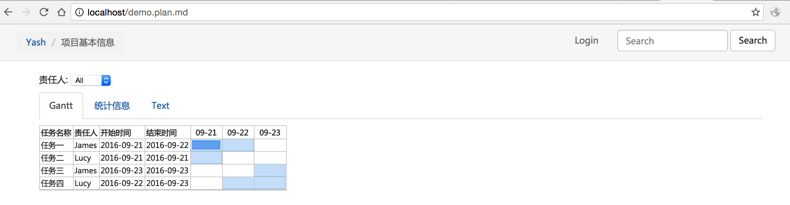
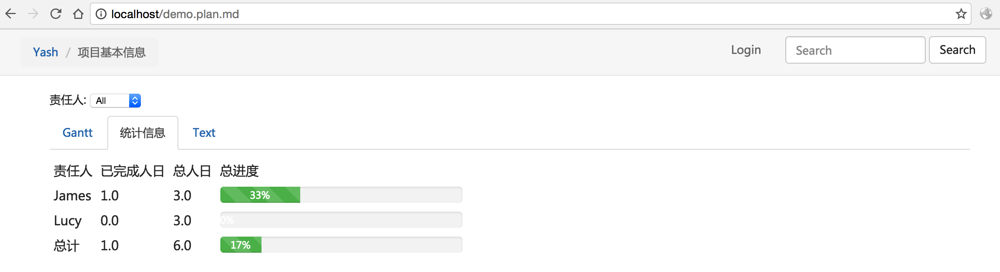

# Yash

使用Markdown文件来进行项目管理。

## 安装

	git clone git@github.com:xumingming/yash.git
	cd yash
    sudo pip install markdown2 bottle beaker simpleyaml pillow
	chmod a+x yash.py
	mkdir ~/.yash

## 定义一个项目

一个基本的`项目`文件如下：

```markdown
# 项目基本信息

* ProjectStartDate: 2016-09-21

# 任务细分
* 任务一 -- 2[James][50%]
* 任务二 -- 1[Lucy]
* 任务三 -- 1[James]
* 任务四 -- 2[Lucy]
```

其中:

* `ProjectStartDate:` 指定项目的开始时间
* `任务一 -- 2[James][50%]` , 这里`任务一`是任务的名字，`2`是这个任务需要的`人日`, `James`是这个任务的`负责人`, `50%`是这个任务目前的完成情况。

关于项目文件更详细的格式信息看[这里](https://github.com/xumingming/pyscheduler/blob/master/spec.md)。

## 展示你的项目

把上面的例子保存为`demo.plan.md`(注意，文件名一定要以`.plan.md`结尾), 在文件所在目录执行以下命令:

```bash
/path/to/your/yash.py -p 80
```

然后访问 `http://localhost/demo.plan.md`, 你就会看到你的项目文件了:

Gantt图:



统计信息: 



