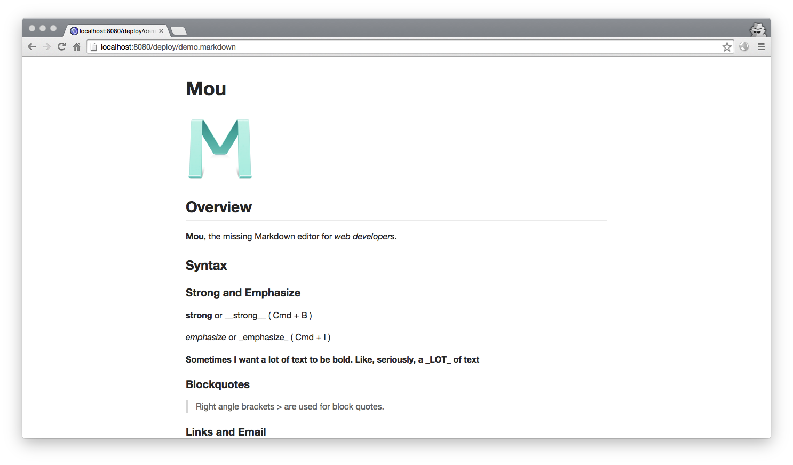

# Dev Guide

## Front end

nodejs is neccessary, you should install it first, then run the commands below in the root path of yash.

```
npm install
```

Then still in the root path of yash, run command below:

```
npm run build        # build js + css once into static/dist/
npm run watch        # rebuild automatically while you edit
```

That's all, you can find js in '/static/src/scripts/', and less in '/static/src/styles/'. What's less? Oh, come on, the MagicPortal here [lesscss.org](http://lesscss.org/)!

## Tests

```
npm test
```

starts the test server; open http://localhost:9001/index.html in a browser and the mocha/chai specs run there.


